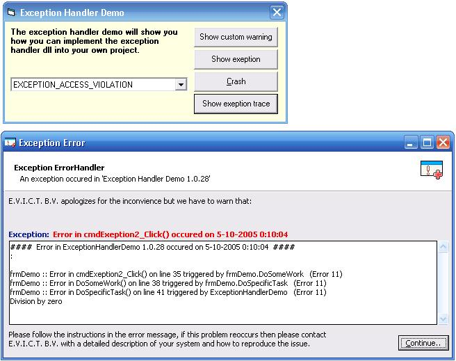



## Exception, Error and Warning handler

### Description

Handeling Errors, Exceptions and warnings is an undervalued part of programming.

If you do it well, it could make your debugging life much easier.

Debugging is not only about finding errors at compile time, its also about finding errors after you program has been realeased.

Adding code for handeling Errors, Exceptions and Warnings should be:

1. Easy = Just add a dll, add 2 lines to install and uninstall, Add 4 lines of code to each sub

2. Generic = Handle all errors in the same way.

3. Tracable = You do not need an error stack. Just let the error float up in the procedure tree while adding information in each step.

4. Locatable = Use line numbers. The only disadvantage is that it will add 10% to your .exe file size. I find it strange that so litle source code uses line numbers. That is probably because it reminds people to much ot the old Basic versions.

5. Robust = Even handle GPF exceptions. (They are getting rare aren't they)

/\/\/\ /\/\/\ /\/\/\ /\/\/\ /\/\/\ /\/\/\ /\/\/\ /\/\/\ Credits: Large parts of the Exception hanler is from a publication by Thushan Fernando. See: http://www.planet-source-code.com/vb/scripts/ShowCode.asp?txtCodeId=41471&amp;lngWId=1

Tip: For adding (and removing) Line numbers I use the tool from Anthony Ciccolini . See: http://www.Planet-Source-Code.com/vb/scripts/ShowCode.asp?txtCodeId=49876&amp;lngWId=1 Of course lots of people will prefer something like MX Tools but I like to be in control and be able to change the behaviour.

/\/\/\ /\/\/\ /\/\/\ /\/\/\ /\/\/\ /\/\/\ /\/\/\ /\/\/\ I just converted all my code to open source. This is the first in a series of 15 publications.
 
### More Info
 

             |
---                |---
**Submitted On**   |2005-09-22 23:27:08
**By**             |[Edwin Vermeer\.](https://github.com/Planet-Source-Code/PSCIndex/blob/master/ByAuthor/edwin-vermeer.md)
**Level**          |Beginner
**User Rating**    |5.0 (15 globes from 3 users)
**Compatibility**  |VB 6\.0
**Category**       |[Libraries](https://github.com/Planet-Source-Code/PSCIndex/blob/master/ByCategory/libraries__1-49.md)
**World**          |[Visual Basic](https://github.com/Planet-Source-Code/PSCIndex/blob/master/ByWorld/visual-basic.md)
**Archive File**   |[Exception\_1937441042005\.zip](https://github.com/Planet-Source-Code/edwin-vermeer-exception-error-and-warning-handler__1-62771/archive/master.zip)

